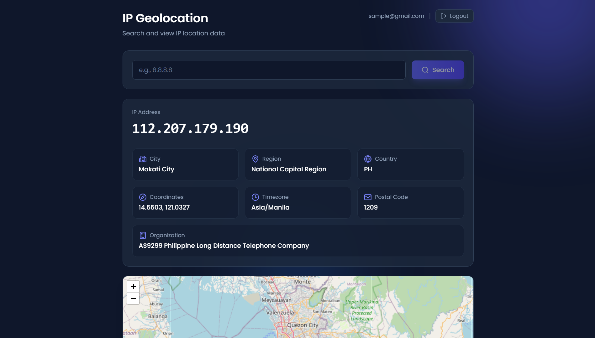
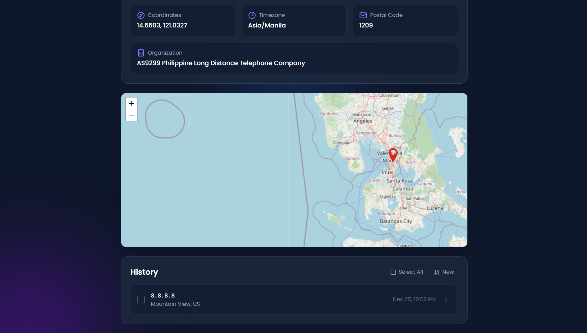
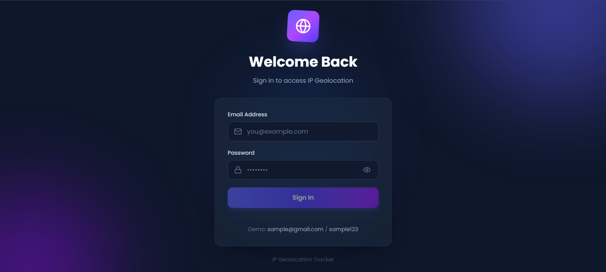
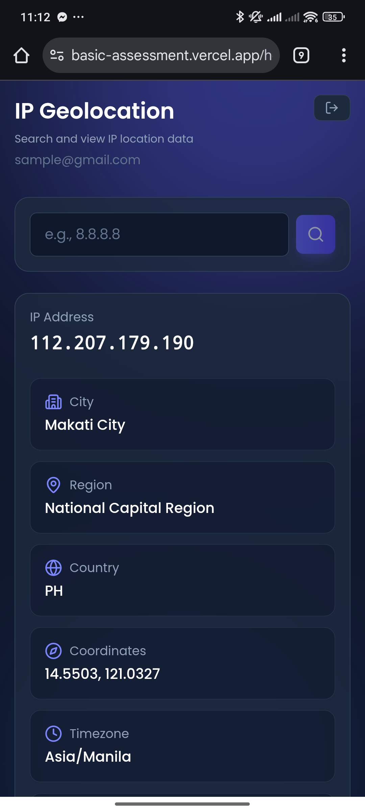

# IP Geolocation Tracker 


## 📸 Screenshots

### Desktop View
<p align="center">
  
  
  
</p>

### Mobile View
<p align="center">
  
  
  
</p>

## Deployment

- **Live Demo:** https://basic-assessment.vercel.app/
- **API URL:** https://basic-assessment-36ls.vercel.app/

---

## How to Run Locally

### 1. Backend Setup
```bash
cd backend
npm install
cp .env.example .env
npm run seed   # Seeds the database with a test user
npm run dev    # Starts server on port 8000
```
### Demo Credentials
For a quick demo, use:
- **Email:** `sample@gmail.com`
- **Password:** `sample123`


> **Note:** The seeder creates a default user. To customize the login credentials, edit `backend/seeders/UserSeeder.ts`:
> ```typescript
> // Please update the test user credentials here :)
> const TEST_EMAIL = 'sample@gmail.com';
> const TEST_PASSWORD = 'sample123';
> ```

### 2. Frontend Setup
```bash
cd frontend
npm install
cp .env.example .env
npm run dev    # Starts React app on port 5173
```


---

## Features
- **Auth:** Secure Login (JWT/HttpOnly Cookies) & Logout
- **Geo:** Real-time IP tracking & Interactive Map (Leaflet)
- **History:** Search history with multi-delete & filters
- **Tech:** React, TypeScript, Node.js, MongoDB, Tailwind CSS
